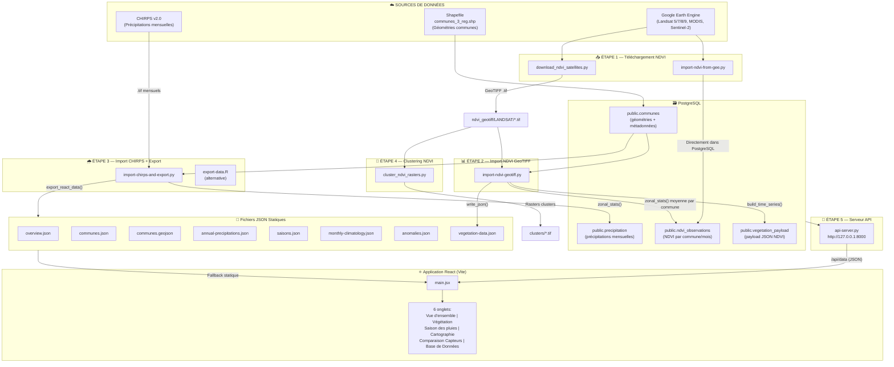

# 🌍 Structure Générale du Projet DYNATSIMO

> Système de suivi agro-végétal et pluviométrique pour le Sud de Madagascar (régions Androy, Anosy, Atsimo-Andrefana)

---

## 🗂️ Arborescence du Projet

```
dynatsimo-react/
├── scripts/                          ← Pipeline de données (Python + R + Node.js)
│   ├── download_ndvi_satellites.py   ← Étape 1: Téléchargement NDVI depuis GEE
│   ├── import-ndvi-from-gee.py       ← Étape 1bis: Import NDVI direct via API GEE
│   ├── import-ndvi-geotiff.py        ← Étape 2: Import GeoTIFF NDVI → PostgreSQL
│   ├── import-chirps-and-export.py   ← Étape 3: Import CHIRPS pluie → PostgreSQL + Export JSON
│   ├── cluster_ndvi_rasters.py       ← Étape 4: Clustering NDVI (CAH + Random Forest)
│   ├── create-ndvi-table.py          ← Utilitaire: Création table ndvi_data
│   ├── generate-mock-data.py         ← Utilitaire: Génération données fictives
│   ├── export-data.R                 ← Étape 3bis: Export R (alternative Python)
│   ├── api-server.py                 ← Étape 5: Serveur API REST Python
│   └── dev.mjs                       ← Orchestrateur dev (API + Vite en parallèle)
│
├── ndvi_geotiff/                     ← Données GeoTIFF NDVI téléchargées
│   ├── LANDSAT/                      ← Rasters NDVI Landsat (.tif)
│   └── download_state.json           ← État du téléchargement
│
├── zone_detude/                      ← Shapefile de la zone d'étude
│   └── communes_3_reg.*              ← Shapefile communes (3 régions)
│
├── public/data/                      ← Fichiers JSON pour le front-end
│   ├── overview.json                 ← Stats générales
│   ├── communes.json                 ← Liste des communes
│   ├── communes.geojson              ← Géométries GeoJSON des communes
│   ├── annual-precipitations.json    ← Précipitations annuelles
│   ├── saisons.json                  ← Caractéristiques saisons des pluies
│   ├── monthly-climatology.json      ← Climatologie mensuelle
│   ├── anomalies.json                ← Anomalies pluviométriques
│   ├── vegetation-data.json          ← Données NDVI (séries temporelles)
│   └── clusters/                     ← Rasters de clusters NDVI
│
├── src/                              ← Application React (front-end)
│   ├── main.jsx                      ← Application complète (2479 lignes)
│   └── styles.css                    ← Feuille de styles
│
├── vite.config.js                    ← Config Vite + proxy API
├── package.json                      ← Dépendances Node.js
└── index.html                        ← Point d'entrée HTML
```

---

## 🔄 Pipeline de Données Complet



---

## 📋 Détails de Chaque Script

---

### 1️⃣ [download_ndvi_satellites.py](file:///c:/Users/Hanitriniala_RH/Documents/Projet_test/dynatsimo-react/scripts/download_ndvi_satellites.py) — Téléchargement NDVI depuis GEE

```
download_ndvi_satellites.py (763 lignes)
        |
        ▼
Authentification Google Earth Engine
        |
        ▼
Chargement du shapefile AOI (zone_detude/communes_3_reg.shp)
  → Conversion en ee.FeatureCollection via geemap/geopandas
        |
        ▼
Configuration des 3 capteurs satellites:
  • Landsat 5/7/8/9 (depuis 2000, résolution 30m)
  • MODIS MOD13Q1 (depuis 2000, résolution 250m)
  • Sentinel-2 (depuis 2017, résolution 10m)
        |
        ▼
Pour chaque satellite et chaque année:
  → Création d'une image mensuelle NDVI (12 bandes/an)
  → Calcul: NDVI = (PIR - Rouge) / (PIR + Rouge)
  → Filtrage nuages (Landsat <40%, Sentinel <30%)
        |
        ▼
Export GeoTIFF vers ndvi_geotiff/{SATELLITE}/
  • Fichiers nommés: {satellite}_ndvi_{YYYY}_{MM}.tif
  • CRS: EPSG:4326, NoData: -9999
        |
        ▼
Sauvegarde état dans download_state.json
```

> **Entrée**: Shapefile AOI + collections Google Earth Engine
> **Sortie**: Fichiers `.tif` dans `ndvi_geotiff/LANDSAT/`, `ndvi_geotiff/MODIS/`, `ndvi_geotiff/SENTINEL/`

---

### 1️⃣bis [import-ndvi-from-gee.py](file:///c:/Users/Hanitriniala_RH/Documents/Projet_test/dynatsimo-react/scripts/import-ndvi-from-gee.py) — Import NDVI Direct via API GEE

```
import-ndvi-from-gee.py (212 lignes)
        |
        ▼
Connexion à Google Earth Engine + PostgreSQL
        |
        ▼
Lecture des communes depuis PostgreSQL
  → Conversion en ee.FeatureCollection
        |
        ▼
Pour chaque capteur (landsat/sentinel/modis) et chaque année:
  → Calcul NDVI mensuel moyen par commune via GEE
  → réduction zonale (reduceRegions) directement dans GEE
        |
        ▼
Insertion dans public.ndvi_data (PostgreSQL)
  → Colonnes: commune_code, sensor, year, month, ndvi
```

> **Entrée**: Collections GEE + géométries communes (PostgreSQL)
> **Sortie**: Table `public.ndvi_data` dans PostgreSQL

---

### 2️⃣ [import-ndvi-geotiff.py](file:///c:/Users/Hanitriniala_RH/Documents/Projet_test/dynatsimo-react/scripts/import-ndvi-geotiff.py) — Import GeoTIFF NDVI → PostgreSQL + JSON

```
import-ndvi-geotiff.py (448 lignes)
        |
        ▼
Connexion PostgreSQL (base: precipitation)
        |
        ▼
Lecture des GeoTIFF NDVI déjà présents
  → Scan récursif de ndvi_geotiff/ (*.tif, *.tiff)
  → Parsing du nom de fichier → capteur, année, mois
        |
        ▼
Lecture des communes depuis PostgreSQL
  → Table: public.communes (avec géométries PostGIS)
  → Champs requis: ADM3_PCODE, ADM3_EN, ADM1_EN, geom
        |
        ▼
Calcul de la moyenne NDVI par commune
  → zonal_stats(communes_gdf, raster, stats=["mean"])
  → Pour chaque raster × chaque commune
        |
        ▼
Enregistrement dans PostgreSQL
  → DROP + CREATE TABLE public.ndvi_observations
  → Colonnes: commune_code, year, month, sensor, ndvi, source_file
  → Insert par chunks de 5000 lignes
        |
        ▼
Construction du payload JSON (time series)
  → build_time_series(): groupement par commune et saison
  → Calcul: NDVI mensuel, cumulatif, anomalies vs baseline
  → Organisation par saison agricole (Oct → Sep)
        |
        ▼
Enregistrement dans PostgreSQL
  → Table: public.vegetation_payload (colonne JSONB)
        |
        ▼
Écriture du fichier JSON statique
  → public/data/vegetation-data.json
```

> **Entrée**: `ndvi_geotiff/*.tif` + géométries communes (PostgreSQL)
> **Sortie**: `public.ndvi_observations` + `public.vegetation_payload` + `vegetation-data.json`

---

### 3️⃣ [import-chirps-and-export.py](file:///c:/Users/Hanitriniala_RH/Documents/Projet_test/dynatsimo-react/scripts/import-chirps-and-export.py) — Import CHIRPS + Export JSON

```
import-chirps-and-export.py (783 lignes)
        |
        ▼
Connexion PostgreSQL (base: precipitation)
        |
        ▼
import_chirps_to_postgres():
  → Lecture des GeoTIFF CHIRPS (*.tif) depuis CHIRPS_data/
  → Parsing date: chirps-v2.0.{YYYY}.{MM}.tif
  → zonal_stats() pour chaque raster × commune
  → CREATE TABLE public.precipitation
  → Colonnes: Commune_Id, Year, Month, Precip
        |
        ▼
export_react_data() → build_react_payload():
        |
        ├──→ overview.json
        │     {nb_communes, nb_years, total_records}
        │
        ├──→ communes.json
        │     [{code, nom, region, district, ecoregion}, ...]
        │
        ├──→ annual-precipitations.json
        │     [{year, precip}, ...] — moyennes annuelles
        │
        ├──→ saisons.json
        │     [{code_commune, saison, debut, fin, duree, mois_plus_pluvieux, precip}, ...]
        │     → calc_saison(): détection début/fin saison des pluies
        │     → Seuil début: ≥50mm + mois suivant plus pluvieux
        │     → Seuil fin: chute ≥50mm entre 2 mois consécutifs
        │
        ├──→ monthly-climatology.json
        │     [{month, precip}, ...] — moyenne mensuelle globale
        │
        ├──→ anomalies.json
        │     [{year, anomaly}, ...] — écart à la climatologie 1981-2010
        │
        ├──→ communes.geojson
        │     FeatureCollection avec propriétés enrichies:
        │     {code, nom, district, region, precip, deficit, alert, ndvi, vegCover, ...}
        │     → Géométries depuis ST_AsGeoJSON(geom)
        │     → Calcul déficit: (précip_2020-2022 − climatologie) / climatologie × 100
        │
        └──→ vegetation-data.json
              → Chargé depuis public.vegetation_payload ou fichier existant
```

> **Entrée**: GeoTIFF CHIRPS + géométries communes (PostgreSQL)
> **Sortie**: `public.precipitation` + 8 fichiers JSON dans `public/data/`

---

### 3️⃣bis [export-data.R](file:///c:/Users/Hanitriniala_RH/Documents/Projet_test/dynatsimo-react/scripts/export-data.R) — Export R (Alternative)

```
export-data.R (308 lignes)
        |
        ▼
Connexion PostgreSQL via RPostgres
        |
        ▼
Lecture des communes + précipitations
  → Même logique que import-chirps-and-export.py
  → calc_saison(): détection début/fin saison des pluies
        |
        ▼
Export des mêmes fichiers JSON dans public/data/
  → overview.json, communes.json, annual-precipitations.json
  → saisons.json, monthly-climatology.json, anomalies.json
  → communes.geojson
```

> Script R équivalent au script Python, pour compatibilité.

---

### 4️⃣ [cluster_ndvi_rasters.py](file:///c:/Users/Hanitriniala_RH/Documents/Projet_test/dynatsimo-react/scripts/cluster_ndvi_rasters.py) — Clustering NDVI

```
cluster_ndvi_rasters.py (591 lignes)
        |
        ▼
Lecture des GeoTIFF NDVI annuels (ndvi_geotiff/)
  → Par satellite: LANDSAT, MODIS, SENTINEL
        |
        ▼
Période de référence: 2000-2011
  → Calcul NDVI moyen mensuel par pixel
  → Standardisation des valeurs
        |
        ▼
Analyse en Composantes Principales (PCA)
  → Sur un échantillon de pixels
        |
        ▼
Classification Ascendante Hiérarchique (CAH Ward)
  → 5 clusters
  → Réordonnancement par NDVI moyen croissant
  → Export dendrogramme: Dendrogramme_CAH_5clusters.png
        |
        ▼
Random Forest
  → Apprentissage sur les clusters de référence
  → Projection sur la période 2012-dernière année
        |
        ▼
Export GeoTIFF clusters:
  → public/data/clusters/{SATELLITE}/Clusters_2000_2011_REFERENCE.tif
  → public/data/clusters/{SATELLITE}/Clusters_2012_YYYY_PROJECTED.tif
```

> **Entrée**: `ndvi_geotiff/{SATELLITE}/*.tif`
> **Sortie**: Rasters de clusters dans `public/data/clusters/`

---

### 5️⃣ [api-server.py](file:///c:/Users/Hanitriniala_RH/Documents/Projet_test/dynatsimo-react/scripts/api-server.py) — Serveur API REST

```
api-server.py (104 lignes)
        |
        ▼
Chargement dynamique de import-chirps-and-export.py
  → Réutilise make_engine() et build_react_payload()
        |
        ▼
Démarrage serveur HTTP (ThreadingHTTPServer)
  → Adresse: http://127.0.0.1:8000
        |
        ▼
Routes disponibles:
  GET /api/health              → {"status": "ok"}
  GET /api/data                → Payload complet (toutes les données)
  GET /api/overview            → Statistiques générales
  GET /api/communes            → Liste des communes
  GET /api/annual-precipitations → Précipitations annuelles
  GET /api/saisons             → Saisons des pluies
  GET /api/monthly-climatology → Climatologie mensuelle
  GET /api/anomalies           → Anomalies pluviométriques
  GET /api/communes.geojson    → GeoJSON des communes
  GET /api/vegetation-data     → Données végétation NDVI
        |
        ▼
Headers CORS activés (Access-Control-Allow-Origin: *)
```

> **Entrée**: Données PostgreSQL via `build_react_payload()`
> **Sortie**: Réponses JSON sur chaque route

---

### 🔧 [dev.mjs](file:///c:/Users/Hanitriniala_RH/Documents/Projet_test/dynatsimo-react/scripts/dev.mjs) — Orchestrateur de Développement

```
dev.mjs (58 lignes)
        |
        ▼
1. Lance api-server.py en arrière-plan
        |
        ▼
2. Attend que l'API soit prête (polling /api/health, max 40 tentatives)
        |
        ▼
3. Lance Vite dev server (front-end React)
        |
        ▼
Résultat: API (port 8000) + Vite (port 5173) en parallèle
  → Vite proxy /api/* → http://127.0.0.1:8000
```

---

### 🔧 [create-ndvi-table.py](file:///c:/Users/Hanitriniala_RH/Documents/Projet_test/dynatsimo-react/scripts/create-ndvi-table.py) — Création Table NDVI

```
create-ndvi-table.py (37 lignes)
        |
        ▼
CREATE TABLE IF NOT EXISTS public.ndvi_data
  → commune_code VARCHAR(50)
  → sensor VARCHAR(20)
  → year INTEGER
  → month INTEGER
  → ndvi DOUBLE PRECISION
  → PRIMARY KEY (commune_code, sensor, year, month)
```

---

### 🔧 [generate-mock-data.py](file:///c:/Users/Hanitriniala_RH/Documents/Projet_test/dynatsimo-react/scripts/generate-mock-data.py) — Données Fictives

```
generate-mock-data.py (358 lignes)
        |
        ▼
Génère des données réalistes pour 12 communes
  → Régions: Androy (4), Anosy (3), Atsimo-Andrefana (5)
  → 4 écorégions: spiny, dry, transition, mangrove
        |
        ▼
Fichiers générés dans public/data/:
  → communes.geojson (avec polygones simplifiés)
  → communes.json
  → overview.json
  → annual-precipitations.json (1981-2024)
  → saisons.json
  → monthly-climatology.json
  → anomalies.json
  → vegetation-data.json (NDVI séries temporelles + écorégions)
```

---

## ⚛️ Application React — [main.jsx](file:///c:/Users/Hanitriniala_RH/Documents/Projet_test/dynatsimo-react/src/main.jsx)

```
main.jsx (2479 lignes)
        |
        ▼
Chargement des données (double stratégie):
  1. Essai API: GET /api/data → payload complet
  2. Fallback: Lecture fichiers JSON statiques dans public/data/
        |
        ▼
6 onglets de navigation:
        |
        ├──→ "Vue d'ensemble" (overview)
        │     • Nombre de communes, période, total enregistrements
        │     • Graphique précipitations annuelles (BarChart)
        │     • Climatologie mensuelle (AreaChart)
        │
        ├──→ "Suivi Végétation" (vegetation)
        │     • Séries temporelles NDVI par commune et saison
        │     • NDVI cumulatif et anomalies
        │     • Baseline par écorégion
        │     • Productivité intégrée
        │
        ├──→ "Saison des pluies" (saison)
        │     • Début/fin de saison par commune
        │     • Durée de la saison
        │     • Précipitations saisonnières
        │     • Mois le plus pluvieux
        │
        ├──→ "Cartographie" (carte)
        │     • Carte Leaflet interactive
        │     • GeoJSON des communes colorées par indicateur
        │     • Popups avec détails: précipitation, déficit, alerte
        │     • Overlay rasters clusters NDVI (ImageOverlay)
        │
        ├──→ "Comparaison Capteurs" (sensors)
        │     • Comparaison Landsat vs MODIS vs Sentinel-2
        │     • Specs techniques et métadonnées capteurs
        │
        └──→ "Base de Données" (data)
              • Table interactive (react-data-table-component)
              • Export données
              • Statut connexion API/Statique
```

---

## 🔗 Flux de Données Résumé (Style Image)

```
┌─────────────────────────────────────────────────────────┐
│           download_ndvi_satellites.py                    │
│     Téléchargement NDVI depuis Google Earth Engine       │
│  (Landsat 5/7/8/9 + MODIS + Sentinel-2 → GeoTIFF .tif) │
└────────────────────────┬────────────────────────────────┘
                         │
                         ▼
┌─────────────────────────────────────────────────────────┐
│              import-ndvi-geotiff.py                      │
│       Lecture des GeoTIFF NDVI déjà présents             │
│            (scan récursif ndvi_geotiff/)                  │
└────────────────────────┬────────────────────────────────┘
                         │
                         ▼
┌─────────────────────────────────────────────────────────┐
│         Calcul de la moyenne NDVI par commune            │
│    zonal_stats(communes, raster, stats=["mean"])         │
│       → Pour chaque GeoTIFF × chaque commune            │
└────────────────────────┬────────────────────────────────┘
                         │
                         ▼
┌─────────────────────────────────────────────────────────┐
│           Enregistrement dans PostgreSQL                  │
│     public.ndvi_observations (NDVI brut)                 │
│     public.vegetation_payload (payload JSON)             │
└────────────────────────┬────────────────────────────────┘
                         │
                         ▼
┌─────────────────────────────────────────────────────────┐
│     import-chirps-and-export.py (précipitations)         │
│   Import CHIRPS GeoTIFF → public.precipitation           │
│   build_react_payload() → 8 fichiers JSON                │
│   + Calcul saisons, anomalies, climatologie, déficits    │
└────────────────────────┬────────────────────────────────┘
                         │
                         ▼
┌─────────────────────────────────────────────────────────┐
│          Création des fichiers JSON statiques             │
│     public/data/*.json (overview, communes, saisons,     │
│     anomalies, climatologie, végétation, geojson)        │
└────────────────────────┬────────────────────────────────┘
                         │
                         ▼
┌─────────────────────────────────────────────────────────┐
│               api-server.py (port 8000)                  │
│      Serveur REST qui lit PostgreSQL en temps réel       │
│            GET /api/data → payload JSON complet           │
└────────────────────────┬────────────────────────────────┘
                         │
                         ▼
┌─────────────────────────────────────────────────────────┐
│            Application React (main.jsx)                  │
│                                                          │
│   Stratégie de chargement:                               │
│   1. Essai API Python → données temps réel               │
│   2. Fallback fichiers JSON → mode hors-ligne            │
│                                                          │
│   6 onglets: Vue d'ensemble | Végétation | Saison        │
│              Cartographie | Capteurs | Base de Données    │
│                                                          │
│   Libs: React + Leaflet + Recharts + DataTable           │
└─────────────────────────────────────────────────────────┘
```

---

## 🗄️ Schéma Base de Données PostgreSQL

| Table | Description | Colonnes clés |
|-------|-------------|---------------|
| `public.communes` | Géométries et métadonnées des communes | `ADM3_PCODE`, `ADM3_EN`, `ADM1_EN`, `geom` (PostGIS) |
| `public.precipitation` | Précipitations mensuelles CHIRPS | `Commune_Id`, `Year`, `Month`, `Precip` |
| `public.ndvi_observations` | Observations NDVI par commune/mois | `commune_code`, `year`, `month`, `sensor`, `ndvi` |
| `public.ndvi_data` | Table alternative NDVI | `commune_code`, `sensor`, `year`, `month`, `ndvi` |
| `public.vegetation_payload` | Payload JSON complet NDVI | `payload` (JSONB), `created_at` |

---

## 📦 Technologies Utilisées

| Composant | Technologies |
|-----------|-------------|
| **Téléchargement données** | Google Earth Engine API (`ee`), `geemap`, `geopandas` |
| **Traitement raster** | `rasterio`, `rasterstats`, `numpy`, `pandas` |
| **Machine Learning** | `scikit-learn` (PCA, Random Forest), `scipy` (CAH Ward) |
| **Base de données** | PostgreSQL + PostGIS, `sqlalchemy` |
| **API backend** | Python `http.server` (ThreadingHTTPServer) |
| **Front-end** | React, Vite, Leaflet, Recharts, react-data-table-component |
| **Alternative R** | DBI, RPostgres, dplyr, sf, jsonlite |

---

## ▶️ Commandes de Lancement

| Commande | Description |
|----------|-------------|
| `npm run dev` | Lance API Python + Vite en parallèle |
| `npm run dev:web` | Lance uniquement Vite (mode statique) |
| `npm run api` | Lance uniquement le serveur API Python |
| `npm run ndvi:import` | Importe les GeoTIFF NDVI dans PostgreSQL |
| `npm run build` | Build de production |
